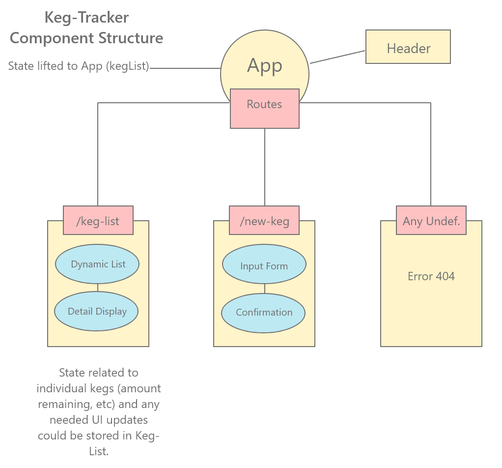

# Component Structure

# Notes

* Had to install File Loader dependency to keep linter/webpack from erroring out on build. Ultimately had to upgrade my file-loader from what was pinned -- which probably means I have another version number somewhere that doesn't match the curriculum.

* Installed, and eventually uninstalled, material-ui for React. Bit of a rabbit hole of functionality that I don't need yet.

* Button font defaults to Arial if Roboto is not set in a css module or inline style. Maybe not inheriting from HTML?

* Had to do a fair bit of image editing to get my splash image to resize in proportion to header/nav.

* Somehow, I wound up in conflict with my Master Branch and had to fix it via pull request. A little alarming - but it worked out in the end.

* Struggled a fair bit with trying to implement stateful components in the morning, had to backtrack after by the afternoon.

# Prompt

In your description of the project include thoughts on the difference in development process in Angular and React.

#### Attribution

Modified vectors sourced from Vexels.com.
